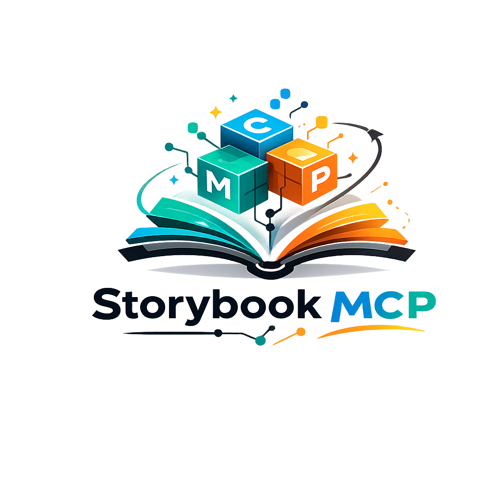

<h1 align="center">Storybook MCP</h1>
<p align="center">
  
</p>

A **universal MCP server** that connects to **any Storybook site** and extracts documentation in real-time using Playwright.

Use it with **any AI or client that supports MCP** (Model Context Protocol)—Cursor, Claude Desktop, Windsurf, or other MCP hosts.

## Features

- **Works with any Storybook** - Auto-detects format and version
- **Live browsing** - Real-time Playwright-based extraction
- **Auto-detection** - Detects Storybook format automatically
- **Single file** - Just `index.js`, no build step

## MCP Configuration

### Using npx (recommended)

Add to your MCP client config (e.g. Cursor: `~/.cursor/mcp.json` or Settings → MCP; Claude: `claude_desktop_config.json`; etc.):

```json
{
  "mcpServers": {
    "storybook-mcp": {
      "command": "npx",
      "args": ["-y", "@raksbisht/storybook-mcp"]
    }
  }
}
```

With a default Storybook URL (optional):

```json
{
  "mcpServers": {
    "storybook-mcp": {
      "command": "npx",
      "args": ["-y", "@raksbisht/storybook-mcp"],
      "env": {
        "STORYBOOK_URL": "https://your-storybook.com"
      }
    }
  }
}
```

### From source (development)

```bash
git clone https://github.com/raksbisht/storybook-mcp.git
cd storybook-mcp
npm install
```

Then in your MCP config:

```json
{
  "mcpServers": {
    "storybook-mcp": {
      "command": "node",
      "args": ["/path/to/storybook-mcp/index.js"]
    }
  }
}
```

## Available Tools

| Tool | Description |
|------|-------------|
| `connect` | Connect to a Storybook URL and get connection status. Required before other tools. |
| `list` | List components and stories in the navigation. Optional: `category`, `full` (hierarchy). |
| `search` | Search for components by name or path. Required: `query`. |
| `get_docs` | Get documentation, code examples, and content for a component or story. Required: `path`. Optional: `full`, `format` (markdown/structured). |
| `screenshot` | Take a screenshot of a component or story. Required: `path`. |

## Example

```
1. connect({ url: "https://storybook.js.org" })
2. search({ query: "button" })
3. get_docs({ path: "components-button--basic" })
```

## Compatibility

Works with common Storybook deployments (various URL formats and `index.json`-based setups).

## License

MIT
